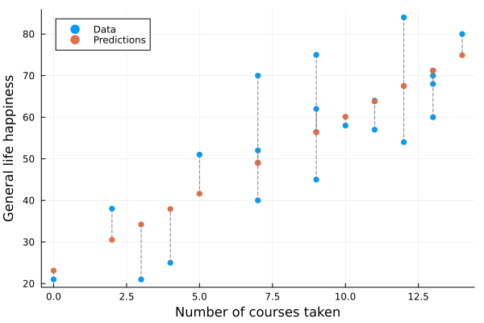

# Least Squares
### A simple least squares implementation on fake data
This notebook shows how to implement a simple list squares on number of courses by happiness in life relation. We plot the data and predictions, as well the residuals.

The notebook is available, as well a static html page version.

